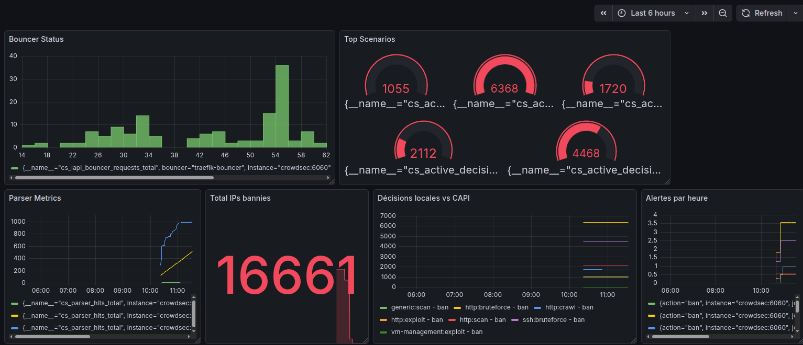
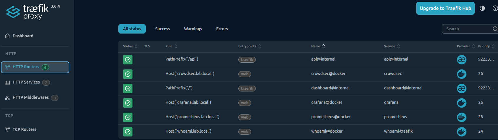
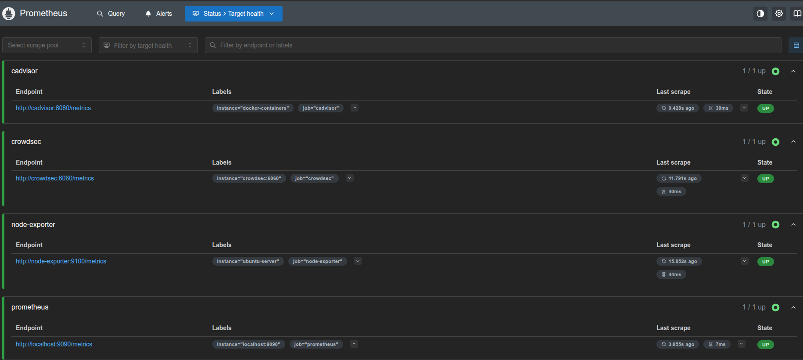

# 🏠 Homelab Infrastructure - Production Docker Stack

> Infrastructure complète de monitoring, sécurité et reverse proxy sur Ubuntu Server 24.04 LTS

[](https://www.docker.com/)
[](https://ubuntu.com/)
[](https://crowdsec.net/)

## 🎯 Vue d'ensemble

Stack Docker professionnelle démontrant des compétences recherchées en entreprise :
- **Administration systèmes Linux** (Ubuntu Server 24.04)
- **Conteneurisation** (Docker, Docker Compose)
- **Monitoring & Observabilité** (Prometheus, Grafana)
- **Cybersécurité** (CrowdSec IDS/IPS + Cyber Threat Intelligence)
- **Automatisation** (Backups, Scripts)

## 🏗️ Architecture Complète
```
┌───────────────────────────────────────────────────────┐
│                 Internet / LAN                         │
└────────────────────┬──────────────────────────────────┘
                     │
                     ▼
              ┌──────────────┐
              │   Traefik    │ ← Reverse Proxy
              │   (Port 80)  │   + CrowdSec Bouncer
              └──────┬───────┘   + Auto-discovery
                     │
        ┏━━━━━━━━━━━━┻━━━━━━━━━━━━━━━━┓
        ▼            ▼                 ▼
   ┌─────────┐  ┌──────────┐    ┌──────────┐
   │ Grafana │  │Prometheus│    │Portainer │
   │  :3000  │  │  :9090   │    │  :9000   │
   └────┬────┘  └────┬─────┘    └──────────┘
        │            │
        └────────────┴───────────┐
                     ▼            ▼
              ┌────────────┐  ┌────────────┐
              │  CrowdSec  │  │Node Export │
              │  Security  │  │ cAdvisor   │
              │  :8081     │  │            │
              └────────────┘  └────────────┘
                     │
                     ▼
              ┌────────────┐
              │   Backups  │
              │ Automation │
              └────────────┘
```

## 📊 Services Déployés

| Service | Description | URL d'accès | Port |
|---------|-------------|-------------|------|
| **Traefik** | Reverse proxy & Load balancer | `dashboard.lab.local` | 80, 8080 |
| **Grafana** | Dashboards de visualisation | `grafana.lab.local` | 3000 |
| **Prometheus** | Collecte de métriques | `prometheus.lab.local` | 9090 |
| **Portainer** | Interface de gestion Docker | `portainer.lab.local` | 9000 |
| **CrowdSec** | IDS/IPS + CTI | `crowdsec.lab.local` | 8081 |
| **Node Exporter** | Métriques système Linux | - | 9100 |
| **cAdvisor** | Métriques containers | - | 8082 |

## 🔒 CrowdSec - Cybersécurité Proactive

### Protection en temps réel

**16 690+ IPs malveillantes bloquées** via la Community API (CTI)

### Types d'attaques détectées et bloquées

| Type d'attaque | Décisions actives |
|----------------|-------------------|
| `http:scan` | 6 387 |
| `ssh:bruteforce` | 4 471 |
| `http:crawl` | 1 725 |
| `http:exploit` | 935 |
| `generic:scan` | 1 055 |

### Fonctionnalités

- ✅ **IDS/IPS collaboratif** : Détection et blocage automatique
- ✅ **Cyber Threat Intelligence** : Base de données mondiale d'IPs malveillantes
- ✅ **Traefik bouncer** : Intégration transparente avec le reverse proxy
- ✅ **Scénarios personnalisables** : SSH, HTTP, exploits CVE
- ✅ **Métriques Prometheus** : Visualisation dans Grafana

## 📈 Monitoring & Observabilité

### Stack de monitoring complète

**Prometheus** collecte les métriques de :
- **Système** : CPU, RAM, Disque, Réseau (Node Exporter)
- **Containers** : Utilisation par container (cAdvisor)
- **Applications** : Métriques spécifiques (Prometheus, CrowdSec)
- **Sécurité** : Alertes, décisions, bans (CrowdSec)

**Grafana** visualise avec :
- Dashboard infrastructure overview
- Dashboard container monitoring
- Dashboard CrowdSec security (16k+ IPs bannies visibles)
- Alerting configurable

## 💾 Backups & Disaster Recovery

### Stratégie de sauvegarde automatisée
```bash
# Backups quotidiens (3h du matin)
backup-homelab.sh
  → Configurations Docker Compose
  → Scripts
  → Rétention : 7 jours

# Backups hebdomadaires (Dimanche 4h)
backup-data.sh
  → Volumes Docker complets
  → Données Grafana, Prometheus, Portainer
  → Rétention : 3 semaines
```

**Stockage** : Disque USB externe 3TB + possibilité NAS

## 🚀 Déploiement Rapide

### Prérequis
```bash
# Ubuntu Server 24.04 LTS
sudo apt update && sudo apt upgrade -y
sudo apt install -y docker.io docker-compose git
```

### Installation
```bash
# 1. Clone le repository
git clone https://github.com/devillesamuel-dot/homelab-docker.git
cd homelab-docker

# 2. Crée les réseaux Docker
docker network create traefik-net
docker network create monitoring
docker network create crowdsec-net

# 3. Déploie les services
cd docker-compose/traefik && docker compose up -d
cd ../monitoring && docker compose up -d
cd ../crowdsec && docker compose up -d
cd ../portainer && docker compose up -d

# 4. Vérifie
docker ps
```

## 📚 Documentation Complète

- [📦 Installation détaillée](docs/INSTALLATION.md)
- [🔧 Configuration Traefik](docs/TRAEFIK.md)
- [🛡️ Setup CrowdSec](docs/CROWDSEC.md)
- [📊 Monitoring Grafana](docs/MONITORING.md)
- [💾 Procédures Backup](docs/BACKUPS.md)
- [🔍 Troubleshooting](docs/TROUBLESHOOTING.md)

## 🎓 Compétences Professionnelles Démontrées

### 🐧 Administration Systèmes Linux
- ✅ Ubuntu Server 24.04 LTS
- ✅ Configuration réseau avancée (DNS local, reverse proxy)
- ✅ Gestion des services systemd
- ✅ Scripting Bash pour automatisation
- ✅ Gestion des permissions et sécurité

### 🐳 Conteneurisation & Orchestration
- ✅ Docker & Docker Compose avancé
- ✅ Gestion multi-réseaux Docker
- ✅ Volumes et persistance des données
- ✅ Orchestration multi-containers
- ✅ Service discovery automatique

### 📊 Monitoring & Observabilité
- ✅ Prometheus (collecte, scraping, PromQL)
- ✅ Grafana (dashboards, alerting, visualisation)
- ✅ Exporters (Node, cAdvisor)
- ✅ Métriques custom et alerting

### 🔐 Cybersécurité
- ✅ **IDS/IPS** (CrowdSec)
- ✅ **Cyber Threat Intelligence** (CTI)
- ✅ **Log analysis** & pattern detection
- ✅ **Incident response** automatisé
- ✅ **Bouncer integration** (Traefik)
- ✅ **Threat hunting** avec métriques

### ⚙️ DevOps & Automation
- ✅ Infrastructure as Code
- ✅ GitOps workflow
- ✅ Automated backups
- ✅ Documentation as Code
- ✅ CI/CD ready

## 📸 Screenshots

### Grafana - CrowdSec Security Dashboard

*16 690+ IPs malveillantes bloquées en temps réel*

### Traefik - Routing & Services

*Reverse proxy avec auto-discovery*

### Prometheus - Targets & Metrics

*Collecte de métriques multi-sources*

## 🛠️ Structure du Projet
```
homelab-docker/
├── docker-compose/              # Fichiers Docker Compose
│   ├── monitoring/             # Prometheus, Grafana, exporters
│   ├── traefik/                # Reverse proxy
│   ├── crowdsec/               # Stack sécurité IDS/IPS
│   └── portainer/              # Gestion Docker
├── docs/                       # Documentation détaillée
│   ├── INSTALLATION.md
│   ├── CROWDSEC.md
│   ├── MONITORING.md
│   └── TROUBLESHOOTING.md
├── scripts/                    # Scripts d'automatisation
│   ├── backup-homelab.sh       # Backup configs
│   └── backup-data.sh          # Backup données
├── screenshots/                # Captures d'écran
└── README.md                   # Ce fichier
```

## 🔧 Maintenance

### Tâches régulières
```bash
# Mise à jour des images Docker
docker compose pull
docker compose up -d

# Vérification des backups
ls -lh ~/backups/

# Analyse des logs de sécurité
docker exec crowdsec cscli metrics
docker exec crowdsec cscli decisions list

# Monitoring de l'utilisation des ressources
docker stats
```

## 🚧 Évolutions Prévues

- [ ] HTTPS avec Let's Encrypt (certificats SSL)
- [ ] Bouncer firewall CrowdSec (protection SSH)
- [ ] VPN WireGuard pour accès distant sécurisé
- [ ] Tests d'intrusion automatisés
- [ ] Intégration Slack/Discord pour alertes
- [ ] Dashboard portfolio personnalisé

## 📞 Contact

**Samuel DEVILLE** - Administrateur Systèmes & Réseaux  
🎯 **Recherche active** : Postes Admin Sys/Réseau, Support N2/N3, Cybersécurité  
📍 **Localisation** : Grenoble, France  
💼 **Expérience** : 15 ans en IT (CORYS Framatome/EDF, Laboratoire BOIRON)  

🔗 **LinkedIn** : [Samuel DEVILLE](https://linkedin.com/in/samuel-deville-b05884207/)  
📧 **Email** : deville.samuel@gmail.com  
🐙 **GitHub** : [devillesamuel-dot](https://github.com/devillesamuel-dot)

## 📄 Licence

MIT License - Projet libre d'utilisation pour apprentissage, référence et inspiration.

---

<div align="center">

### ⭐ Si ce projet vous inspire ou vous aide, n'hésitez pas à le star !

**Conçu avec 💙 pour démontrer des compétences professionnelles en infrastructure moderne**

</div>
